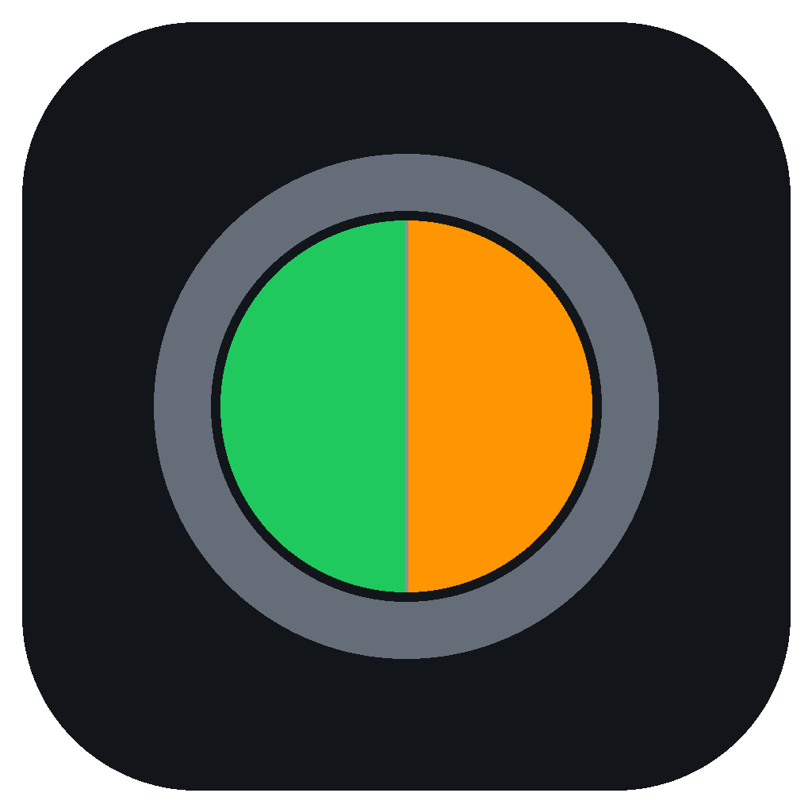
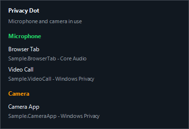
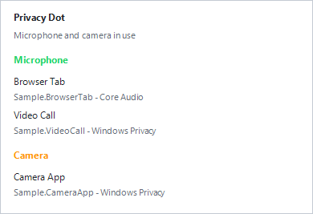

<p align="center">
  
</p>

<h1 align="center">PrivacyDot</h1>

<p align="center">
  A tiny Windows tray privacy indicator for microphone and camera activity.
</p>

<p align="center">
  <a href="https://github.com/farflashgroup/PrivacyDot/releases/latest"></a>
  <a href="https://github.com/farflashgroup/PrivacyDot/actions"></a>
  <a href="LICENSE"></a>
  
  
</p>

PrivacyDot sits in the Windows notification area and gives you a quick visual read on device use:

- Gray: no microphone or camera use detected
- Green: microphone use detected
- Orange: camera use detected
- Split green/orange: both detected

Left-click the dot to see the apps currently detected under **Microphone** and **Camera**. Right-click for refresh, Windows privacy settings, Start with Windows, and Exit.

PrivacyDot follows your Windows app theme when showing its popup and tray menu, with dark mode support on Windows versions that expose the app-theme setting.

## Screenshots

| Dark mode | Light mode |
| --- | --- |
|  |  |

## Install

Download the latest `PrivacyDotSetup.exe` from the [releases page](https://github.com/farflashgroup/PrivacyDot/releases/latest).

The installer:

- Installs per-user to `%LOCALAPPDATA%\PrivacyDot`
- Creates Start Menu and Startup shortcuts
- Checks for Microsoft .NET Framework 4.8
- Launches PrivacyDot after installation

No administrator privileges are required.

## Compatibility

PrivacyDot targets .NET Framework 4.8 so it can run on Windows 7 SP1 and newer. Modern .NET no longer supports Windows 7, but .NET Framework 4.8 and the Core Audio APIs used for microphone session detection are compatible with Windows 7 SP1.

Camera app detection uses the Windows privacy usage registry when it exists, which is available on newer Windows versions. On Windows 7, the app still runs and microphone detection uses Core Audio, but camera app attribution is best-effort because Windows 7 does not expose the Windows 10+ privacy usage records.

## Build

```powershell
dotnet build .\PrivacyDot.slnx -c Release
.\PrivacyDot.Tests\bin\Release\net48\PrivacyDot.Tests.exe
```

The build uses `Microsoft.NETFramework.ReferenceAssemblies.net48` so the .NET Framework developer pack does not have to be installed globally.

## Build The Installer

```powershell
powershell -NoProfile -ExecutionPolicy Bypass -File .\installer\BuildInstaller.ps1
```

The installer builder uses the Windows IExpress tool included with Windows and writes `PrivacyDotSetup.exe` to `artifacts\` by default.

## Privacy

PrivacyDot does not collect telemetry, phone home, or send device usage anywhere. It reads local Windows APIs and registry usage records on the current machine only.

## License

PrivacyDot is open source under the [MIT License](LICENSE).
